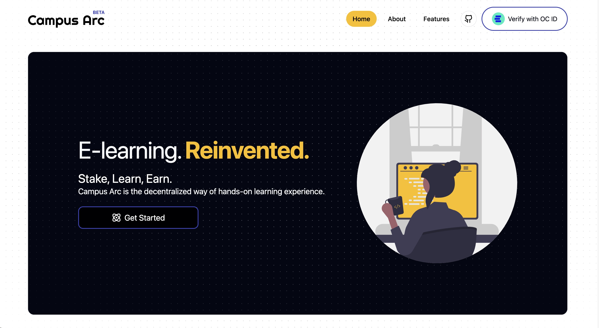

 
 

# 📌 Important Notes for The EDU Chain Hackathon Judges

- ❗ Since the www.campusarc.io domain is not whitelisted by Open Campus, it's not possible to demo this project live (OC ID Verification does not work). Also, since the project works with sensitive data in the .env file, it's not possible for you to test this project on your localhost. Thus, I highly recommend watching [the comprehensive demo video on YouTube that describes the whole project and demonstrates the end-to-end user flow in detail](https://youtu.be/eYv6hm_RsdA).
- ❗ Since this is the BETA version of the Campus Arc -which is mainly built for the EDU Chain Hackathon- many concepts and features that make the application complete were skipped. This is because of the time limit of the hackathon and to focus on the Solidity-Contract side of the application, which was the crucial part of the hackathon. These features will be added in the next months and are listed down below.
- ❗ It is all-important to note that Campus Arc is not merely a hackathon project. Its roots are based on The Sustainable Development Goals of the United Nations, as mentioned in the About section in detail. So, after this hackathon, Campus Arc will be held as a real start-up project that has its own economic sustainability structures, completely dynamic user experience, and all other listed features that are skipped for this hackathon.
    

# 👀 ✍️💰 Campus Arc BETA

Verify your identity with Open Campus ID, stake 0.1 EDUToken, learn, and earn!
  

## 📖 About The Project

Campus Arc is a next-gen web-based e-learning and e-collaboration Web2/Web3 app where college students can match with their campus (or world) fellows, build meaningful projects in their field of expertise together, and increase their competency by gaining project-based experiences.

Campus Arc aims to spread project-based competency in the scope of college campuses and make graduations more meaningful. Thus, it has a relatively deeper meaning/purpose than just being one of the Learning Management Systems or hackathon projects.
  

### Key Web3 / Blockchain Features

1. **_Stake & Learn & Earn!:_** A student has to stake 0.1 EDU to register for an Arc Module. After this, they will start to be rewarded regularly until the deadline of the module. If they can successfully complete the module (that includes tasks, projects, etc.) by the deadline, they will be able to withdraw their stake with its reward. The total return amount is calculated as follows:

   - 1.1. 💰 <strong>Total Return Amount: </strong> Staking time (the deadline of the Module) &times; EDUToken amount staked times &times; Reward Rate
   - 1.2. 🎁 <strong>Reward Rate: </strong> 1e15
   - 1.3. <strong>Example Case: </strong> A student who staked 100 EDUToken for 30 days will be rewarded 2592 EDUToken per 30 days / 86,4 EDUTokens per day

2. **_Open Campus ID Verification:_** Campus Arc BETA has a simplistic authentication infrastructure that is based on OC-ID verification. No users are allowed to take any actions without OC ID verification.

3. **_Custom ERC20 Token - EDUToken:_** Campus Arc uses a custom ERC20 token, deployed on opencampus Network. Users will use this token for staking and withdrawing.

4. **_Wallet Management:_** Users can manage their wallet using WalletConnect SDK.
     

### Key Web2 Features

1. **_Completely Dynamic User Experience:_** All the application data is based on the PostgreSQL database, deployed on the Vercel with Prisma.
2. **_Basic Profile Management:_** Users can update basic profile details and review the Arc Modules that they are registered with and the Registration Stake records.
3. **_Module Registration and Tracking:_** Dynamic registration and progress tracking.
     

### Key Educational Concepts & Features

- **_Arc Modules:_** An Arc Module is a high-quality course module where the learning experience is smoothly integrated with hands-on practices, homework, projects, a reward system, an AI-assisted feedback system, and real-time collaboration infrastructure.
- **_Arc Designers:_** Arc Designers are the creators of the Arc Modules. Any student can become an Arc Designer, after completing the Arc Designer Tutorial with the same Stake & Learn & Earn system successfully. This, again, provides both motivation to be an Arc Designer in Campus Arc and a community-based creation.
- **_Community:_** The 'Campus' side of the Campus Arc incredibly crucial part. Students will be able to connect with their fellows (from the same campus or the world), build, and earn together.
- **_Motivation Factor:_** Students are motivated by both a high-quality and hands-on learning experience and the idea of earning while learning. It's expected that students will be motivated to complete the course before the deadline successfully not to lose their stakes and also to earn the reward. Also, another motivation factor is, of course, gaining a blockchain certificate!
    

### Skipped Features & Concepts for this Hackathon (Will be applied in the future)

In the future applications, students will be able to;

- **_Arc Module Contents:_** Overview and go over all the lessons, tasks, and projects (Arc Module materials).
- **_AI-Assisted Learning:_** Get help and feedback while completing tasks and lessons.
- **_Certificates Page:_** View and manage all the earned certificates for completed Arc Modules and projects.
- **_Arc Designer Panel Page:_** Create and customize new Arc Modules, including lessons, tasks, and assessments.
- **_Community Page:_** Connect with other students, participate in discussions, join community events, and learn/build together.
- **_Statistics Page:_** Track personal progress, course completion rates, and performance metrics.
- **_Real-Time Collaboration:_** Students can invite their friends to their own registered Arc Modules to collaborate in real-time, thanks to WebSockets.
- **_Support Page:_** Access FAQs, contact support, and receive guidance on technical or academic issues.
- **_Settings Page:_** Have more comprehensive control over their account, including privacy settings, notification preferences, and profile customization.
- **_Responsiveness:_** Experience a fully device-compatible application.
   
   

🔗 [Presentation & Demonstration Video]](https://youtu.be/eYv6hm_RsdA)

🔗 [The DoraHacks Official Showcase Page](https://dorahacks.io/buidl/15481)

🔗 [Live Demo](https://www.campusarc.io)

 

## 🌟 Project Development Progress

Campus Arc BETA is built in just 6 days for the EDU Chain Hackathon Semester 1 of Open Campus. 🔗 [See the official hackathon page](https://dorahacks.io/hackathon/educhain/buidl)

 

## 🤝 Team

- **Hüseyin Karataş:** Brand Design, UI/UX Design and Development, Front-End Engineering, Back-End Engineering, Implementing Back-End Interactions, Contract Design, Development and Deployment, Contract Interactions

 

## 🛠️ Stack

### 🖌️🎨 Front-End

- ocid-connect-js SDK for Open Campus ID verification
- Next.js
- React.js
- TypeScript
- TailwindCSS
- Shadcn/ui
- Aceternity UI
- Framer Motion
- Lucide React
- WalletConnect - AppKit
- Vercel for deployment
- Figma for brand design
- Wagmi hooks for contract interactions

### ⚙️ 🗄️ Back-End

- PostgreSQL
- Vercel DB
- TypeScript
- Prisma
- Prisma ORM

### 📜 Smart Contracts

- Hardhat (Solidity)
- OpenZeppelin
- Hardhat Toolbox
- Dotenv
- Wagmi
- Viem
- Ethers

 

## 🖼️ Screenshots From The App (A Regular User Flow)

#### Hero

  

#### About Us

  

#### Features

  

#### OC ID Verification - 1

  

#### OC ID Verification - 2

  

#### OC ID Verification - 3

  

#### OC ID Verification - 4

  

#### OC ID Verification - 5 - Redirecting to the App

  

#### Verified with OC ID, created Student data in DB

  

#### Dashboard - My Learning

  

#### Dashboard - Profile - 1

  

#### Dashboard - Profile - 2

  

#### Dashboard - Profile - 3

  

#### Dashboard - All Arc Modules

  

#### Arc Module Page

  

#### Register Now Action - Informing

  

#### Register Now Action - Informing 2

  

#### Taking Allowance

  

#### Taking Approval - 1

  

#### Taking Approval - 2

  

#### Confirming Staking

  

#### Unauthorized Page

  
